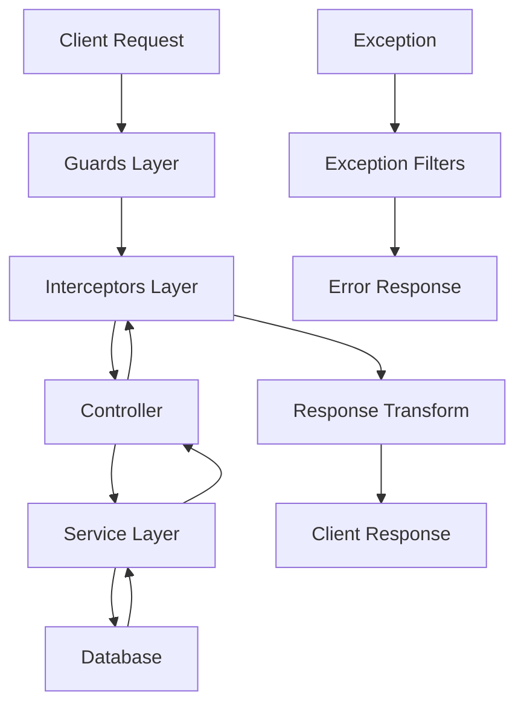
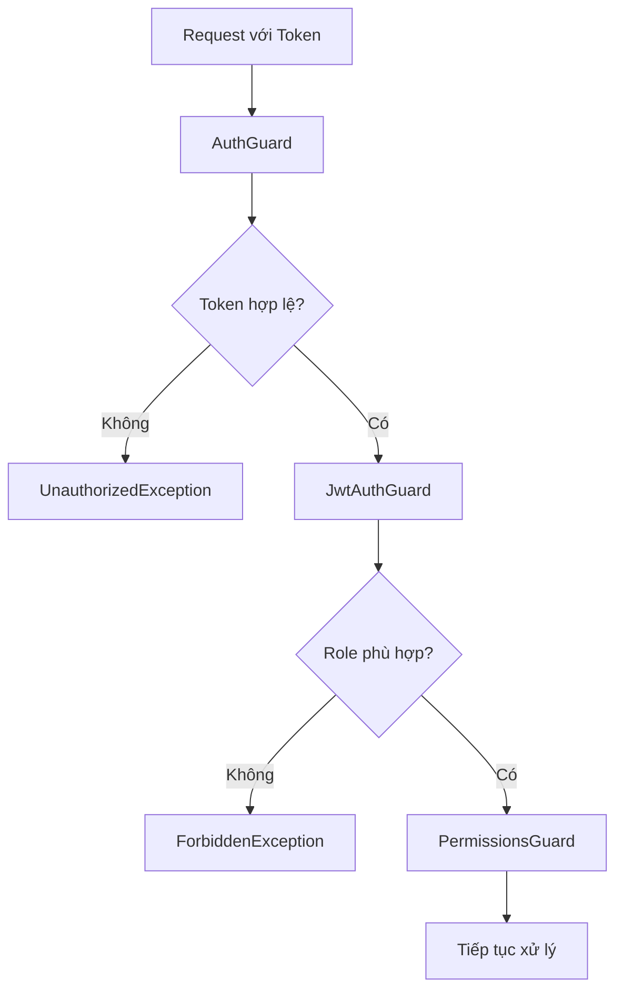

# Common Module - Tài liệu Hướng dẫn Chi tiết

## 📋 Tổng quan

Module `Common` là trung tâm của ứng dụng WebChat, chứa tất cả các thành phần được chia sẻ và tái sử dụng trong toàn bộ hệ thống. Module này được thiết kế theo kiến trúc modular của NestJS, cung cấp các dịch vụ, guards, interceptors, filters, DTOs và utilities cần thiết cho việc xây dựng một ứng dụng chat hiện đại và bảo mật.

## 🏗️ Cấu trúc Thư mục Chi tiết

```
common/
├── constants/                    # Các hằng số ứng dụng
│   ├── app.constants.ts         # Hằng số chính của ứng dụng
│   ├── app.constants.spec.ts    # Unit tests cơ bản
│   ├── app.constants.advanced.spec.ts  # Unit tests nâng cao
│   ├── app.constants.integration.spec.ts  # Integration tests
│   ├── app.constants.test-utils.ts  # Test utilities
│   └── README.md               # Tài liệu test suite
├── decorators/                  # Custom decorators
│   └── custom.decorators.ts    # Các decorator tùy chỉnh
├── dto/                        # Data Transfer Objects
│   ├── api.response.dto.ts     # DTO response chính
│   ├── base.response.dto.ts    # DTO response cơ bản
│   ├── bulkaction.dto.ts       # DTO cho bulk operations
│   ├── error.response.dto.ts   # DTO cho error response
│   ├── paginated.response.dto.ts  # DTO cho paginated response
│   ├── pagination.dto.ts       # DTO cho pagination
│   ├── queryparams.dto.ts      # DTO cho query parameters
│   ├── search.dto.ts          # DTO cho search operations
│   ├── success.response.dto.ts # DTO cho success response
│   └── validation.error.dto.ts # DTO cho validation errors
├── filters/                    # Exception filters
│   ├── businesslogic.exception.filters.ts  # Business logic errors
│   ├── database.exception.filters.ts     # Database errors
│   ├── global.exception.filters.ts       # Global error handler
│   ├── http.exception.filters.ts         # HTTP errors
│   ├── ratelimit.exception.filters.ts    # Rate limit errors
│   ├── timeout.exception.filters.ts     # Timeout errors
│   └── validationexception.filters.ts   # Validation errors
├── guards/                     # Authentication & Authorization guards
│   ├── apikey.guards.ts        # API key authentication
│   ├── auth.guards.ts          # Basic authentication guard
│   ├── group.admin.guards.ts   # Group admin authorization
│   ├── group.member.guards.ts  # Group member authorization
│   ├── jwt.auth.guard.ts       # JWT authentication
│   ├── message.owner.guards.ts # Message ownership check
│   ├── permissions.guards.ts   # Permission-based authorization
│   ├── ratelimit.guards.ts     # Rate limiting guard
│   ├── roles.guards.ts         # Role-based authorization
│   └── throttle.guards.ts      # Request throttling
├── interceptors/               # Request/Response interceptors
│   ├── cache.interceptors.ts   # Response caching
│   ├── compression.interceptors.ts  # Response compression
│   ├── logging.interceptors.ts # Request/response logging
│   ├── performance.interceptors.ts  # Performance monitoring
│   ├── ratelimit.interceptors.ts   # Rate limiting
│   ├── request.id.interceptors.ts  # Request ID generation
│   ├── response.transform.interceptors.ts  # Response transformation
│   ├── sanitization.interceptors.ts  # Input sanitization
│   ├── security.headers.interceptors.ts  # Security headers
│   └── timeout.interceptors.ts # Request timeout
├── pipes/                      # Custom pipes (empty)
├── services/                   # Shared services
│   ├── analytic.services.ts    # Analytics tracking
│   ├── cache.services.ts       # In-memory caching
│   ├── email.services.ts       # Email service
│   ├── fileupload.services.ts   # File upload handling
│   ├── healthcheck.services.ts # Health monitoring
│   └── notification.services.ts # Push notifications
├── types/                      # TypeScript type definitions
│   └── express.d.ts           # Express type extensions
├── utils/                      # Utility functions
│   ├── date.utils.ts          # Date manipulation utilities
│   ├── files.utils.ts         # File handling utilities
│   ├── object.utils.ts        # Object manipulation utilities
│   ├── pagination.utils.ts    # Pagination utilities
│   ├── password.utils.ts      # Password handling utilities
│   ├── response.utils.ts      # Response formatting utilities
│   ├── string.utils.ts        # String manipulation utilities
│   └── validation.utils.ts    # Validation utilities
├── common.module.ts           # Module configuration
├── index.ts                   # Export definitions
└── README.md                  # Tài liệu này
```

## 🔄 Flow Nghiệp vụ

### 1. Request Processing Flow



### 2. Authentication Flow



## 📁 Chi tiết từng Thư mục và File

### 🔧 Constants (`constants/`)

**Mục đích**: Chứa tất cả các hằng số được sử dụng trong ứng dụng

#### `app.constants.ts`
- **Chức năng**: File chính chứa tất cả constants của ứng dụng
- **Nội dung**:
  - `APP_CONSTANTS`: Cấu hình database, messages, users, groups, JWT, pagination, file upload, rate limiting
  - `ERROR_MESSAGES`: Thông báo lỗi chuẩn hóa cho tất cả modules
  - `SUCCESS_MESSAGES`: Thông báo thành công chuẩn hóa
  - `DB_ERROR_CODES`: Mã lỗi MongoDB
  - `RECEIVER_TYPES`, `USER_ROLES`, `MEMBER_STATUS`, `MESSAGE_TYPES`: Các enum quan trọng
  - `CACHE_KEYS`, `REDIS_KEYS`: Keys cho caching và Redis

#### `app.constants.spec.ts`
- **Chức năng**: Unit tests cơ bản cho constants
- **Nội dung**: Test values, types, regex patterns, array properties

#### `app.constants.advanced.spec.ts`
- **Chức năng**: Unit tests nâng cao với edge cases và performance testing
- **Nội dung**: Comprehensive regex testing, numeric range validation, business logic constraints

#### `app.constants.integration.spec.ts`
- **Chức năng**: Integration tests cho module import/export
- **Nội dung**: Module functionality, immutability testing, NestJS integration

#### `app.constants.test-utils.ts`
- **Chức năng**: Test utilities và helper methods
- **Nội dung**: `ConstantsTestUtils` class với regex testing, validation utilities

#### `README.md`
- **Chức năng**: Tài liệu chi tiết về test suite
- **Nội dung**: Test coverage, categories, utilities documentation

### 🎯 Decorators (`decorators/`)

#### `custom.decorators.ts`
**Mục đích**: Custom decorators để tăng cường metadata cho controllers và methods

**Parameter Decorators**:
- `@CurrentUser()`: Lấy user hiện tại từ request
- `@CurrentUserId()`: Lấy user ID từ request
- `@ClientIP()`: Lấy IP address của client
- `@UserAgent()`: Lấy User-Agent header
- `@Pagination()`: Lấy pagination parameters (page, limit, sortBy, sortOrder)
- `@SearchQuery()`: Lấy search query từ request
- `@RequestId()`: Lấy request ID cho tracing
- `@Language()`: Lấy language từ Accept-Language header
- `@Timezone()`: Lấy timezone từ X-Timezone header

**Method Decorators**:
- `@Roles(...roles)`: Yêu cầu roles cụ thể
- `@Permissions(...permissions)`: Yêu cầu permissions cụ thể
- `@Public()`: Đánh dấu endpoint công khai (skip auth)
- `@RateLimit(limit, windowMs)`: Giới hạn rate cho endpoint
- `@Cache(ttl, key?)`: Cache response với TTL
- `@ValidationGroups(...groups)`: Validation groups
- `@ApiVersion(version)`: API versioning
- `@Deprecated(message?)`: Đánh dấu endpoint deprecated
- `@ApiDescription(description)`: Mô tả API
- `@ApiExample(example)`: Ví dụ response

**Ví dụ sử dụng**:
```typescript
@Public()
@Roles('admin')
@Permissions('read:users')
@RateLimit(100, 60000)
async getUsers(@CurrentUser() user, @Pagination() pagination) {
  // Implementation
}
```

### 📦 DTOs (`dto/`)

**Mục đích**: Data Transfer Objects để định nghĩa cấu trúc dữ liệu và validation

#### `api.response.dto.ts`
- **Chức năng**: DTO response chính với metadata
- **Properties**: `success`, `message`, `data`, `errors`, `meta` (timestamp, requestId, version)
- **Methods**: `success()`, `error()` static methods

#### `base.response.dto.ts`
- **Chức năng**: DTO response cơ bản
- **Properties**: `success`, `message`, `data`, `error`, `timestamp`
- **Methods**: `success()`, `error()` static methods

#### `bulkaction.dto.ts`
- **Chức năng**: DTO cho bulk operations
- **Classes**:
  - `BulkActionDto`: `ids: string[]`, `action: string`
  - `IdParamDto`: `id: string`

#### `error.response.dto.ts`
- **Chức năng**: DTO cho error responses
- **Inherits**: `BaseResponseDto`
- **Constructor**: `error`, `message`

#### `paginated.response.dto.ts`
- **Chức năng**: DTO cho paginated responses
- **Inherits**: `BaseResponseDto<T[]>`
- **Properties**: `pagination` object với page, limit, total, totalPages, hasNext, hasPrev

#### `pagination.dto.ts`
- **Chức năng**: DTO cho pagination parameters
- **Properties**: `page`, `limit`, `sortBy`, `sortOrder`
- **Validation**: Min/Max values, enum validation

#### `queryparams.dto.ts`
- **Chức năng**: DTO cho query parameters
- **Properties**: `page`, `limit`, `search`, `sort`, `order`
- **Similar**: To `pagination.dto.ts` but with additional search/sort fields

#### `search.dto.ts`
- **Chức năng**: DTO cho search operations
- **Inherits**: `PaginationDto`
- **Additional Classes**:
  - `SearchDto`: `q`, `filter` properties
  - `DateRangeDto`: `startDate`, `endDate` properties
  - `FileUploadDto`: `filename`, `mimetype`, `size`, `path` properties

#### `success.response.dto.ts`
- **Chức năng**: DTO cho success responses
- **Inherits**: `BaseResponseDto<T>`
- **Constructor**: `data`, `message`

#### `validation.error.dto.ts`
- **Chức năng**: DTO cho validation errors
- **Properties**: `field`, `message`, `value`

### 🛡️ Guards (`guards/`)

**Mục đích**: Bảo vệ routes và kiểm soát quyền truy cập

#### `auth.guards.ts`
- **Chức năng**: Kiểm tra authentication cơ bản
- **Sử dụng**: Global guard cho tất cả routes
- **Logic**: Kiểm tra `@Public()` decorator, nếu không có thì yêu cầu user authenticated
- **Implementation**: Sử dụng Reflector để check metadata

#### `jwt.auth.guard.ts`
- **Chức năng**: Xác thực JWT token
- **Sử dụng**: Cho các routes yêu cầu authentication
- **Logic**: Verify JWT token và attach user vào request
- **Implementation**: JWT strategy integration

#### `apikey.guards.ts`
- **Chức năng**: Xác thực API key
- **Sử dụng**: Cho API endpoints
- **Logic**: Check `X-API-Key` header, validate against environment variables
- **Environment**: `VALID_API_KEYS` comma-separated list

#### `roles.guards.ts`
- **Chức năng**: Kiểm tra role của user
- **Sử dụng**: Với `@Roles()` decorator
- **Logic**: So sánh user role với role yêu cầu từ metadata
- **Implementation**: Reflector + metadata checking

#### `permissions.guards.ts`
- **Chức năng**: Kiểm tra permissions cụ thể
- **Sử dụng**: Với `@Permissions()` decorator
- **Logic**: Kiểm tra user có permission cần thiết từ metadata
- **Implementation**: Granular permission checking

#### `ratelimit.guards.ts`
- **Chức năng**: Giới hạn số lượng requests
- **Sử dụng**: Bảo vệ chống spam và DDoS
- **Logic**: Đếm requests theo IP/user và block nếu vượt ngưỡng
- **Implementation**: In-memory counter với sliding window

#### `throttle.guards.ts`
- **Chức năng**: Throttling requests
- **Sử dụng**: Giới hạn tần suất requests
- **Logic**: Delay requests nếu vượt quá threshold
- **Implementation**: Queue-based throttling

#### `group.admin.guards.ts`
- **Chức năng**: Kiểm tra quyền admin trong group
- **Sử dụng**: Cho các operations liên quan đến group admin
- **Logic**: Verify user có phải admin của group không
- **Implementation**: Check `user.adminGroups` array

#### `group.member.guards.ts`
- **Chức năng**: Kiểm tra quyền member trong group
- **Sử dụng**: Cho các operations liên quan đến group
- **Logic**: Verify user có phải member của group không
- **Implementation**: Check `user.groups` array

#### `message.owner.guards.ts`
- **Chức năng**: Kiểm tra quyền sở hữu message
- **Sử dụng**: Cho edit/delete message
- **Logic**: Chỉ cho phép owner của message thực hiện
- **Implementation**: Check `message.sender_id` vs `user.id`

### 🔄 Interceptors (`interceptors/`)

**Mục đích**: Xử lý request/response trước và sau khi controller thực thi

#### `logging.interceptors.ts`
- **Chức năng**: Log tất cả requests và responses
- **Sử dụng**: Global interceptor
- **Thông tin log**: Method, URL, IP, User-Agent, Duration, Status Code
- **Implementation**: RxJS operators với tap và catchError

#### `performance.interceptors.ts`
- **Chức năng**: Đo thời gian thực thi và performance metrics
- **Sử dụng**: Monitor performance
- **Metrics**: Response time, memory usage, CPU usage
- **Implementation**: Performance.now() và process.memoryUsage()

#### `sanitization.interceptors.ts`
- **Chức năng**: Làm sạch input data
- **Sử dụng**: Bảo vệ chống XSS và injection
- **Logic**: Escape HTML, validate input format, remove malicious content
- **Implementation**: DOMPurify-like sanitization

#### `security.headers.interceptors.ts`
- **Chức năng**: Thêm security headers
- **Sử dụng**: Tăng cường bảo mật
- **Headers**: CSP, HSTS, X-Frame-Options, X-Content-Type-Options, etc.
- **Implementation**: Set response headers

#### `cache.interceptors.ts`
- **Chức năng**: Cache responses
- **Sử dụng**: Tối ưu performance
- **Logic**: Cache theo URL và parameters với TTL
- **Implementation**: In-memory cache với expiry

#### `compression.interceptors.ts`
- **Chức năng**: Nén response
- **Sử dụng**: Giảm bandwidth
- **Algorithm**: Gzip compression
- **Implementation**: Compression middleware integration

#### `request.id.interceptors.ts`
- **Chức năng**: Tạo unique ID cho mỗi request
- **Sử dụng**: Tracking và debugging
- **Format**: UUID v4
- **Implementation**: Attach to request object

#### `response.transform.interceptors.ts`
- **Chức năng**: Chuẩn hóa response format
- **Sử dụng**: Đảm bảo consistency
- **Logic**: Wrap response trong ApiResponseDto
- **Implementation**: Transform response data

#### `timeout.interceptors.ts`
- **Chức năng**: Giới hạn thời gian xử lý
- **Sử dụng**: Tránh hanging requests
- **Default**: 30 seconds
- **Implementation**: RxJS timeout operator

#### `ratelimit.interceptors.ts`
- **Chức năng**: Giới hạn requests theo thời gian
- **Sử dụng**: Bảo vệ chống abuse
- **Logic**: Sliding window algorithm
- **Implementation**: In-memory counter với cleanup

### 🚨 Filters (`filters/`)

**Mục đích**: Xử lý exceptions và errors

#### `global.exception.filters.ts`
- **Chức năng**: Catch tất cả exceptions
- **Sử dụng**: Global filter
- **Logic**: Phân loại exception và trả về response phù hợp
- **Handles**: HttpException, MongoError, generic Error
- **Response**: Standardized error format với error codes

#### `http.exception.filters.ts`
- **Chức năng**: Xử lý HTTP exceptions
- **Sử dụng**: Cho BadRequest, NotFound, etc.
- **Logic**: Map HTTP status codes thành error responses
- **Implementation**: Catch HttpException specifically

#### `database.exception.filters.ts`
- **Chức năng**: Xử lý database errors
- **Sử dụng**: Cho MongoDB errors
- **Logic**: Handle duplicate key (11000), validation errors (121)
- **Implementation**: Catch MongoError với specific error codes

#### `validationexception.filters.ts`
- **Chức năng**: Xử lý validation errors
- **Sử dụng**: Cho DTO validation
- **Logic**: Format validation errors thành readable format
- **Implementation**: Parse class-validator error format

#### `businesslogic.exception.filters.ts`
- **Chức năng**: Xử lý business logic errors
- **Sử dụng**: Cho custom business rules
- **Logic**: Handle domain-specific errors với `isBusinessError` flag
- **Implementation**: Custom error format với error codes

#### `ratelimit.exception.filters.ts`
- **Chức năng**: Xử lý rate limit errors
- **Sử dụng**: Khi vượt quá rate limit
- **Logic**: Return 429 status với retry-after header
- **Implementation**: Specific rate limit error handling

#### `timeout.exception.filters.ts`
- **Chức năng**: Xử lý timeout errors
- **Sử dụng**: Khi request timeout
- **Logic**: Return 408 status với timeout message
- **Implementation**: Timeout-specific error handling

### 🛠️ Services (`services/`)

**Mục đích**: Các dịch vụ được chia sẻ trong ứng dụng

#### `cache.services.ts`
- **Chức năng**: In-memory caching với TTL
- **Sử dụng**: Cache user profiles, group info, etc.
- **Features**: 
  - `set(key, data, ttl)`: Set cache với expiry
  - `get(key)`: Get cached data
  - `delete(key)`: Remove cache entry
  - `clear()`: Clear all cache
  - `has(key)`: Check cache existence
  - `cleanExpiredEntries()`: Auto cleanup với cron job

#### `email.services.ts`
- **Chức năng**: Gửi email với template support
- **Sử dụng**: Notifications, password reset, etc.
- **Features**: 
  - Template-based emails
  - Async sending
  - Error handling
  - SMTP configuration

#### `notification.services.ts`
- **Chức năng**: Push notifications và real-time alerts
- **Sử dụng**: Real-time notifications
- **Features**: 
  - WebSocket integration
  - Mobile push notifications
  - Notification queuing
  - User preferences

#### `fileupload.services.ts`
- **Chức năng**: Upload và quản lý files
- **Sử dụng**: Profile photos, attachments
- **Features**: 
  - `uploadFile(file, destination)`: Upload với validation
  - `deleteFile(filePath)`: Delete files
  - `generateFileName(originalName)`: Generate unique filenames
  - File type validation
  - Size limits

#### `analytic.services.ts`
- **Chức năng**: Track user behavior và analytics
- **Sử dụng**: Business intelligence, metrics
- **Features**: 
  - `trackEvent(eventName, properties)`: Track custom events
  - `trackUserAction(userId, action, properties)`: Track user actions
  - `trackMessageSent(senderId, receiverType, receiverId)`: Track messages
  - `trackGroupCreated(creatorId, groupId, memberCount)`: Track group creation
  - `getEventStats(eventName)`: Get event statistics
  - `cleanOldEvents()`: Auto cleanup với cron job

#### `healthcheck.services.ts`
- **Chức năng**: Health monitoring và system status
- **Sử dụng**: System monitoring, uptime checks
- **Features**: 
  - Database connection status
  - Memory usage monitoring
  - CPU utilization
  - Service availability
  - Health endpoint

### 🔧 Utils (`utils/`)

**Mục đích**: Utility functions và helper methods

#### `password.utils.ts`
- **Chức năng**: Password handling và security
- **Methods**: 
  - `generateSalt()`: Tạo salt ngẫu nhiên
  - `hashPassword(password, salt)`: Hash với SHA-256 + salt
  - `hashPasswordWithSalt(password)`: Tạo salt và hash
  - `verifyPassword(password, hash, salt)`: Verify password
  - `comparePassword(password, hash)`: Bcrypt comparison
  - `validatePasswordStrength(password)`: Kiểm tra độ mạnh password
- **Security**: SHA-256 + salt, bcrypt integration

#### `date.utils.ts`
- **Chức năng**: Date manipulation và formatting
- **Methods**: 
  - `now()`: Current date
  - `addDays(date, days)`: Add days to date
  - `addHours(date, hours)`: Add hours to date
  - `addMinutes(date, minutes)`: Add minutes to date
  - `isExpired(date)`: Check if date is expired
  - `formatDate(date, format)`: Format date với custom format
  - `getTimeAgo(date)`: Human-readable time ago
- **Additional**: `ArrayUtils` class với unique, chunk, shuffle, groupBy, sortBy methods

#### `string.utils.ts`
- **Chức năng**: String manipulation và formatting
- **Methods**: 
  - `capitalize(str)`: Capitalize first letter
  - `capitalizeWords(str)`: Capitalize all words
  - `slugify(str)`: Convert to URL-friendly slug
  - `truncate(str, length, suffix)`: Truncate string
  - `generateRandomString(length)`: Generate random string
  - `generateUUID()`: Generate UUID
  - `maskEmail(email)`: Mask email for privacy
  - `maskPhoneNumber(phoneNumber)`: Mask phone number

#### `object.utils.ts`
- **Chức năng**: Object manipulation và utilities
- **Methods**: 
  - `deepClone(obj)`: Deep clone object
  - `isEmpty(obj)`: Check if object is empty
  - `pick(obj, keys)`: Pick specific properties
  - `omit(obj, keys)`: Omit specific properties
  - `merge(target, ...sources)`: Merge objects

#### `validation.utils.ts`
- **Chức năng**: Validation helpers và utilities
- **Methods**: 
  - `isValidObjectId(id)`: Validate MongoDB ObjectId
  - `isValidPhoneNumber(phoneNumber)`: Validate phone number
  - `isValidEmail(email)`: Validate email format
  - `isValidUrl(url)`: Validate URL format
  - `isValidImageUrl(url)`: Validate image URL
  - `sanitizeString(input)`: Sanitize string input
  - `isValidPassword(password)`: Validate password strength
  - `isValidName(name)`: Validate name format
- **Integration**: Sử dụng constants từ `app.constants.ts`

#### `pagination.utils.ts`
- **Chức năng**: Pagination logic và calculations
- **Methods**: 
  - `calculatePagination(page, limit, total)`: Calculate pagination info
  - `validatePaginationParams(page, limit)`: Validate và normalize params
- **Returns**: page, limit, total, totalPages, hasNext, hasPrev, offset

#### `response.utils.ts`
- **Chức năng**: Response formatting utilities
- **Methods**: 
  - `success(data, message)`: Format success response
  - `error(message, error)`: Format error response
  - `paginated(data, page, limit, total, message)`: Format paginated response
- **Integration**: Sử dụng `PaginationUtils` cho pagination

#### `files.utils.ts`
- **Chức năng**: File handling utilities
- **Methods**: 
  - `getFileExtension(filename)`: Get file extension
  - `isValidImageType(mimetype)`: Validate image MIME type
  - `formatFileSize(bytes)`: Format file size (Bytes, KB, MB, GB)
  - `generateFileName(originalName)`: Generate unique filename
- **Security**: Crypto-based filename generation

### 📝 Types (`types/`)

#### `express.d.ts`
- **Chức năng**: Extend Express Request interface
- **Extensions**: 
  - `user?: { id?: string; _id?: string; [key: string]: any }`
  - `requestId?: string`
- **Usage**: Global type augmentation cho Express

### 🔧 Cấu hình Module

#### `common.module.ts`
- **Imports**: `ScheduleModule.forRoot()` cho cron jobs
- **Providers**: Tất cả services, guards, interceptors, filters
- **Global Providers**:
  - `APP_GUARD`: `AuthGuard` (global authentication)
  - `APP_INTERCEPTOR`: `SanitizationInterceptor` (global sanitization)
  - `APP_INTERCEPTOR`: `LoggingInterceptor` (global logging)
  - `APP_FILTER`: `GlobalExceptionFilter` (global error handling)
- **Exports**: Tất cả providers để sử dụng trong modules khác

#### `index.ts`
- **Chức năng**: Export definitions cho module
- **Exports**: 
  - Constants từ `app.constants.ts`
  - DTOs từ các file DTO
  - Utilities từ các file utils
  - Services, guards, interceptors, filters

## 📊 Monitoring & Logging

### Logging Strategy

1. **Request Logging**: Tất cả incoming requests với method, URL, IP, User-Agent
2. **Response Logging**: Tất cả outgoing responses với status code và duration
3. **Error Logging**: Chi tiết exceptions và stack traces
4. **Performance Logging**: Response times và resource usage
5. **Security Logging**: Authentication failures, rate limiting violations

### Metrics Collection

- **Response Times**: P50, P95, P99 percentiles
- **Error Rates**: 4xx, 5xx error percentages
- **Throughput**: Requests per second
- **Resource Usage**: Memory, CPU utilization
- **Cache Hit Rates**: Cache performance metrics
- **Analytics Events**: User behavior tracking

## 🔒 Security Considerations

### Authentication & Authorization

1. **JWT Tokens**: Secure token-based authentication với expiration
2. **Role-based Access**: Granular permission system với roles và permissions
3. **Rate Limiting**: Protection against abuse với sliding window algorithm
4. **Input Sanitization**: XSS và injection prevention
5. **API Key Authentication**: Alternative authentication method
6. **Password Security**: SHA-256 + salt, bcrypt integration

### Data Protection

1. **Password Hashing**: Multiple hashing methods (SHA-256 + salt, bcrypt)
2. **Input Validation**: Comprehensive validation rules với class-validator
3. **Output Encoding**: XSS prevention
4. **CORS Configuration**: Cross-origin request control
5. **Security Headers**: CSP, HSTS, X-Frame-Options, etc.
6. **Data Masking**: Email và phone number masking utilities

## 🚀 Performance Optimization

### Caching Strategy

1. **In-memory Cache**: Fast access to frequently used data với TTL
2. **Response Caching**: Cache API responses với cache interceptor
3. **Database Query Caching**: Reduce database load
4. **Static Asset Caching**: CDN integration
5. **Auto Cleanup**: Cron jobs để clean expired cache entries

### Compression & Optimization

1. **Gzip Compression**: Reduce response sizes với compression interceptor
2. **Response Transformation**: Optimize data format với transform interceptor
3. **Lazy Loading**: Load data on demand
4. **Connection Pooling**: Efficient database connections
5. **Request Optimization**: Request ID tracking và timeout handling
